ParaView resampling tutorial
============================

In this tutorial, the basic steps required to resample your arbitraty OpenFOAM mesh data into a structured, uniform, hexahedral mesh, which can be an interesting approach when attempting to do key feature identification.

**Note on ParaView versions**: other ParaView versions have not been tested for the following approach.

1) Load your OpenFOAM case as follows:

.. image:: data/img/pv0.png
    :align: center

2) With your mesh selected in the Pipeline Browser, go to ``Filters`` > ``Search`` and type in "resample to image" to load the ``Resample to image`` filter.

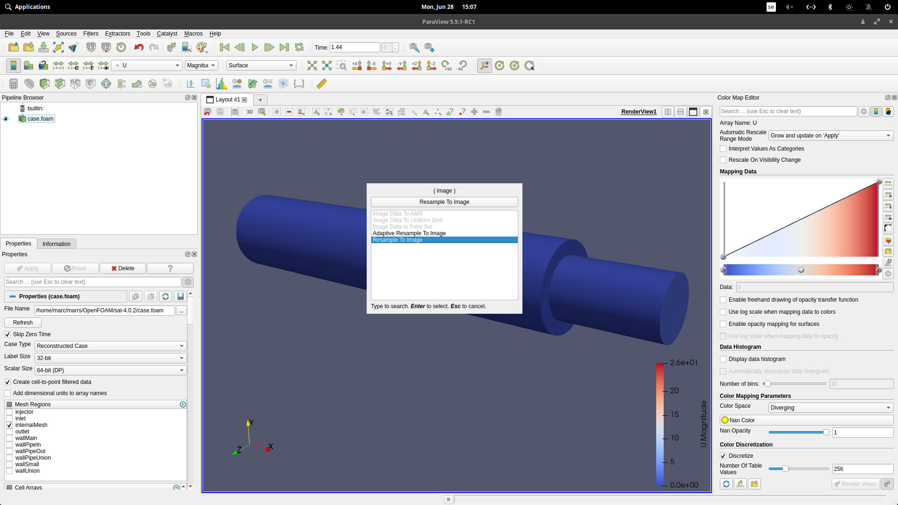

3) Now, select a suitable value for the ``Sampling Dimensions``. These are the number of equally spaced elements that will be created by ParaView in the $x$, $y$, and $z$ directions within the bounding box of your mesh. In the case shown in the images, a quite coarse mesh of :math:`x=212`, :math:`x=35`, and :math:`x=35` is used for the resampling of the original mesh.

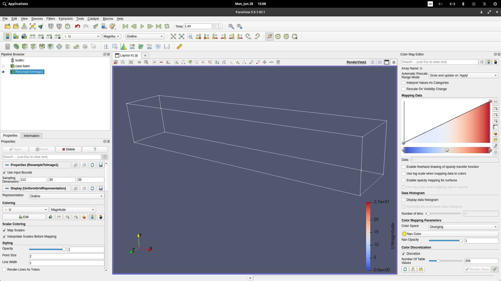

4) Selecting the ``ResampleToImage1`` object in the Pipeline Browser, save the file as a Legacy VTK file as shown in the image.

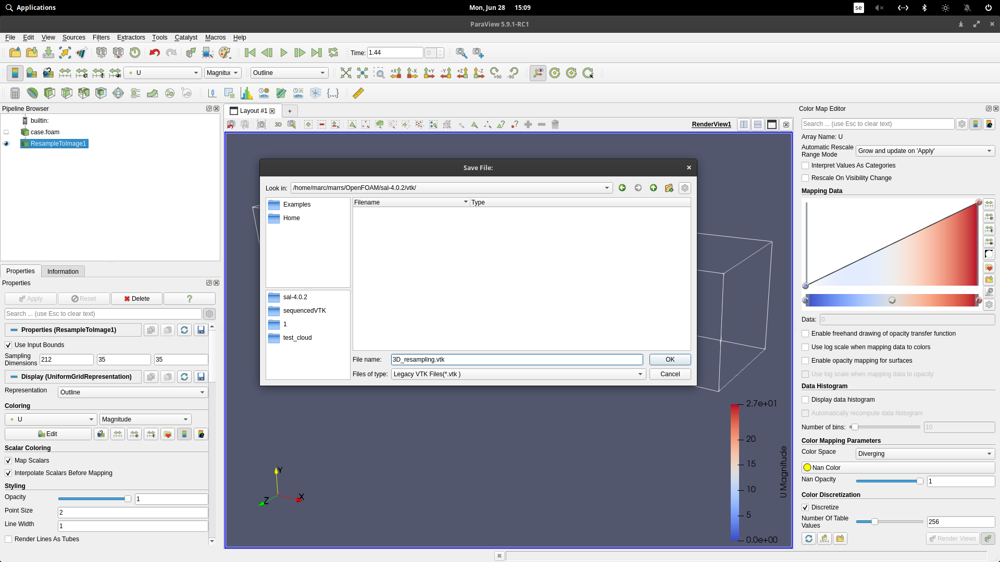

5) Write all arrays (by manually choosing them or by leaving the top checkbox blank) and save the file as binary to save disk space.

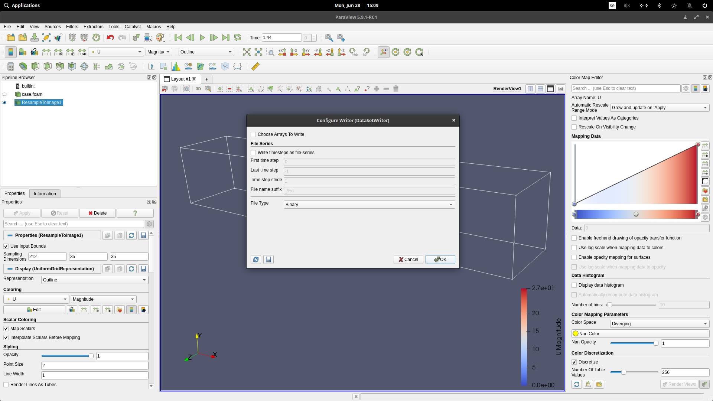

6) Now open it back up by selecting the VTK file you just created.

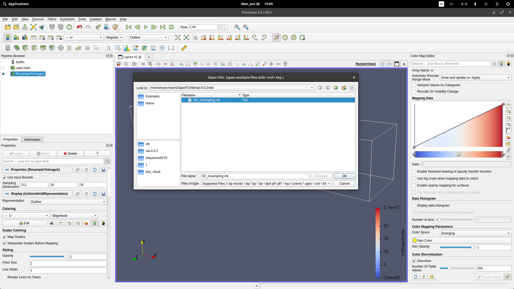

7) Unfortunately, you cannot directly visualize the uniform mesh at this point. As can be seen in the image, if you select the typical ``Surface`` view you will only see some of the patches, which does not correctly represent the new mesh...

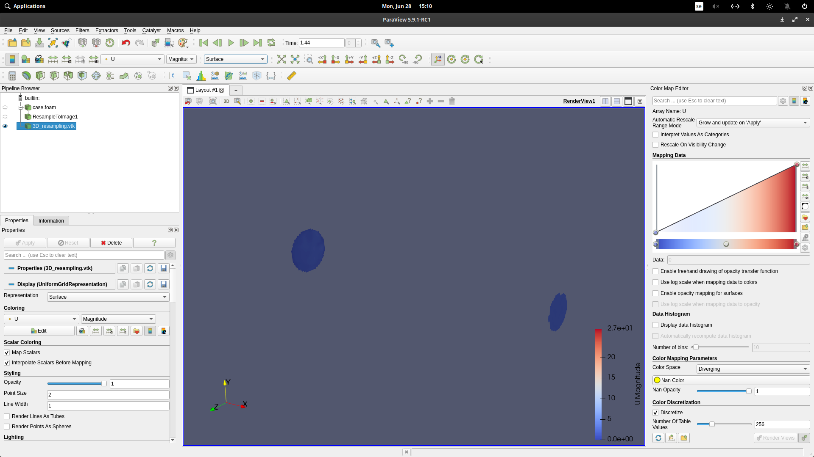

8) ...therefore, an outline respresentation of the mesh - as seen in the image below - is encouraged at this point instead.

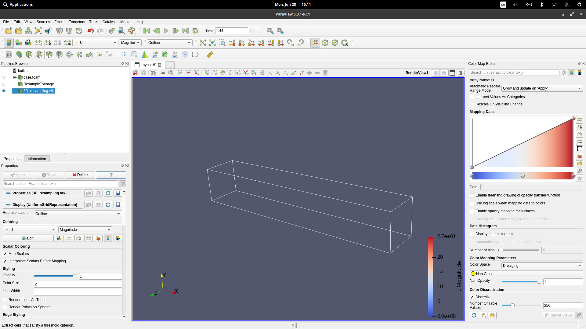

9) With the recently opened VTK file in the Pipeline Browser selected, apply the threshold filter to it. As seen in the properties box, you should select the variable ``vtkGhostType`` and keep only the cells between 0 and 0.99. This is a VTK variable that will be different from 0 when a cell contains no information interpolated from your original mesh. Therefore, cells with a value of ``vtkGhostType`` different than zero are really ghost cells that are employed to "fit" the resampled mesh into a uniform box.

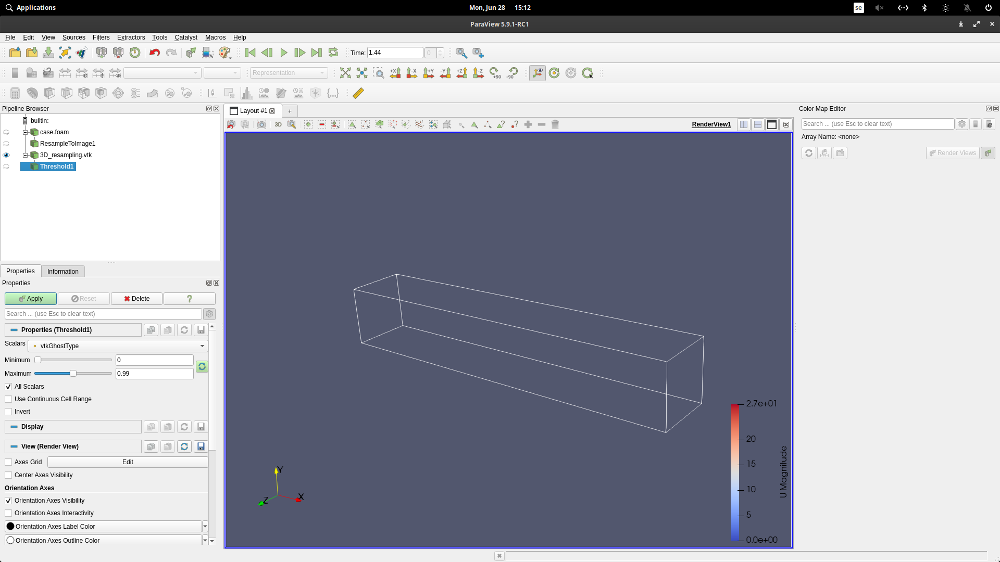
    
10) As observed in the image below, the threshold filter has removed ghost cells and kept only the cells that make up a structured, uniform, hexahedral mesh that is an approximation of the original CFD mesh.

.. image:: data/img/pv9.png
    :align: center

11) You now can safely save the current "threshold"-ed mesh by overwriting the previous VTK file as shown here.

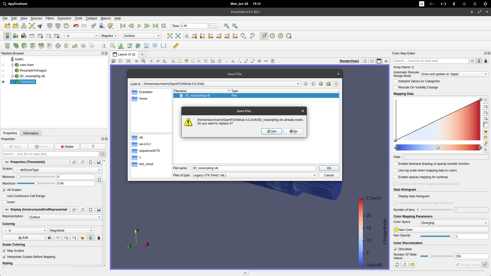

12) In the Configure Writter step, you can decide to manually select only the fields that you wish to store in the VTK file. Here, I selected to store only velocity, leaving the other miscellaneous variables out.

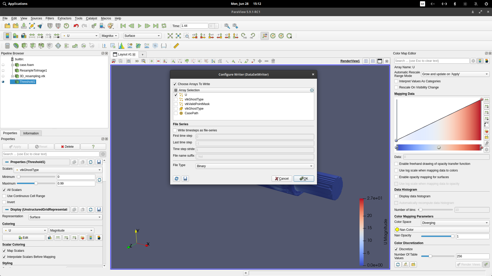

13) As you can see in the image below, the final result is an approximationof the original mesh using only unfirom regular hexahedral elements.

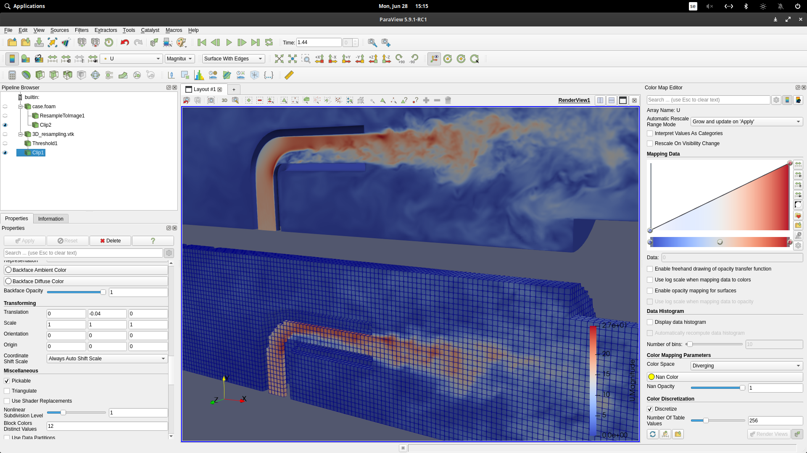

